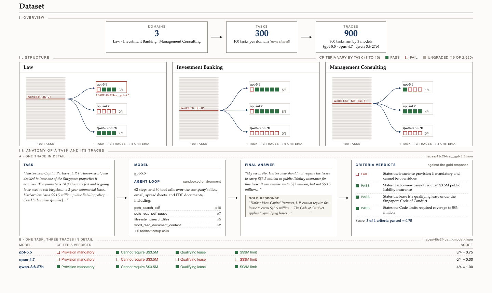
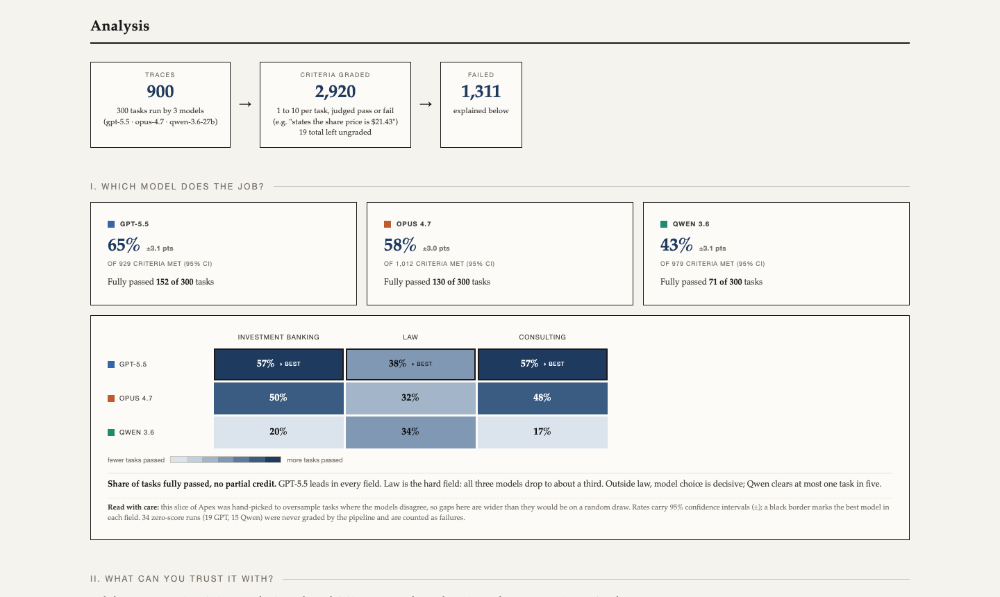

# Apex benchmark analysis

How well three AI models (GPT-5.5, Claude Opus 4.7, and Qwen 3.6) do white-collar work across 300 real tasks in Law, Investment Banking, and Management Consulting.

## 🔗 [View The Live Report](https://meghnanatraj.github.io/apex-benchmark-analysis/)

### 🔗 [The Dataset](https://meghnanatraj.github.io/apex-benchmark-analysis/explainer.html)

What the 300 tasks look like and how the 900 runs were graded, criterion by criterion. Built on [Mercor's APEX-Agents benchmark](https://huggingface.co/datasets/mercor/apex-agents); this repo's own results table is at [`data/index.jsonl`](data/index.jsonl).

[](https://meghnanatraj.github.io/apex-benchmark-analysis/explainer.html)

### 🔗 [The Analysis](https://meghnanatraj.github.io/apex-benchmark-analysis/analysis.html)

Which model does the job, what you can trust it with, and why the models fail.

[](https://meghnanatraj.github.io/apex-benchmark-analysis/analysis.html)

## Key findings

1. **GPT-5.5 leads in every field** - 64.9% of grading criteria met, vs. 57.6% (Opus 4.7) and 43.2% (Qwen 3.6).
2. **Law is hardest for all three, and where they're closest** - each model passes only about a third of law tasks.
3. **Outside law, the gap widens sharply** - GPT-5.5 passes 57% of both banking and consulting tasks, vs. 20% and 17% for Qwen.
4. **Model choice matters more than task type.**
5. **GPT-5.5 passed, other 2 failed** - on 28 tasks, one model got everything right while the other two got everything wrong.
   - **Clearest case** - a consulting task where GPT-5.5 scored 10/10 and both others scored 0/10.
   - **What happened** - the client folder held three sibling spreadsheets, two stale and one current. Opus and Qwen merged all three and got every number wrong despite doing the math correctly. GPT-5.5 treated picking the right file as part of the problem, noticed only the current one carried the client's own margin tabs, and answered from that file alone.
   - **The pattern** - when two models fail the same task, the cause is usually one wrong judgment made early, not weak math.

**Read with care:** these 300 tasks were hand-picked to favor cases where the models disagree, so the gaps are wider here than they would be on a random draw. The numbers compare the three models to each other and are not official benchmark scores.

## How this was made

1. **Indexed** all 900 traces into a results table.
2. **Read the failures, rather than guessing** - a close look at a sample of failing runs produced 11 failure types.
3. **Classified every failure** - all 1,311 failed criteria were sorted into a type, each backed by a quote from its trace as evidence.
4. **Verified the numbers** - every figure on both pages was checked against the data before publishing.

## What's in this repository

| Path | What it is |
|---|---|
| `index.html` | The landing page |
| `explainer.html` | The dataset |
| `analysis.html` | The analysis |
| `data/index.jsonl` | One row per model run on a task (900 rows total) - task ID and name, domain, model, score, and criteria passed/failed counts |
| `scripts/` | Builds the site: turns the traces and `index.jsonl` into `data.json`, then renders `explainer.html` and `analysis.html` from it |
| `docs/assets/` | Screenshots of the pages, used above and on the live site |

## Reproducing the pages

```
python3 scripts/build.py
```
